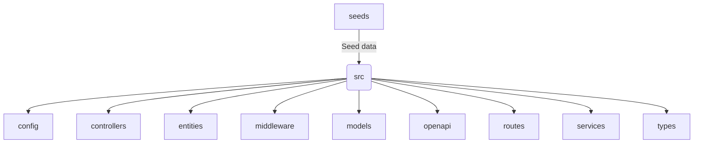
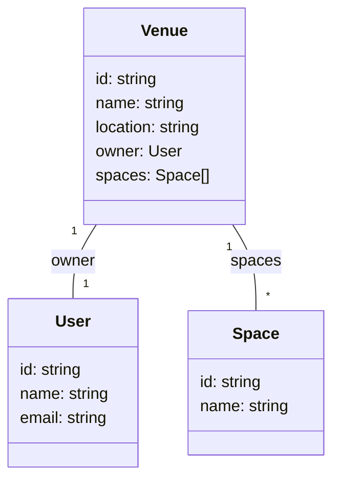

# Event Booking Platform

A TypeScript-based platform for managing events, venues, spaces, bookings, and users.

## Features
- Event creation and management
- Venue and space management
- User authentication and roles
- Booking system
- RESTful API with Swagger documentation

## Project Structure


## Main Models


## Getting Started
1. Install dependencies:
   ```bash
   npm install
   ```
2. Build the project:
   ```bash
   npm run build
   ```
3. Run the server:
   ```bash
   npm start
   ```

## API Documentation
- See `src/swagger.ts` and `src/openapi/openapi.yaml` for API docs.

## License
This project is licensed under the [MIT License](./LICENSE).
